# System 1 Decision Benchmark · provisional v5

This provisional successor contains **1,456 questions across 43 categories**. It removes the exact 701 questions answered correctly by all 26 configurations in the original v4 main graph, while retaining every remaining question and recorded primary response. All 38 preceding complete configurations retain their recorded answers. Four native hosted configurations add full-bank sessions on the same frozen inputs. The complete v4 bank and reports remain unchanged.

**Inclusion threshold: 45% (at least 656/1,456 correct).** The user set this cutoff after reviewing Super Decider’s 669/1,456 (45.95%), the lowest score among the preceding graph models. Inclusion uses the exact rule **correct ×100 ≥45 ×1,456**, requiring at least **656 correct**, including ties. All 38 preceding complete configurations are preserved and four native hosted configurations are added; 34 configurations appear in the active graph after the threshold and explicit version-selection decision, with 2 superseded reference(s).

[Interactive provisional v5 report](https://etsabary.github.io/system-1-decision-benchmark/v5/report.html) · [Category rankings](https://etsabary.github.io/system-1-decision-benchmark/v5/report.html#rankings) · [Cost evidence](https://etsabary.github.io/system-1-decision-benchmark/v5/report.html#cost) · [Archived full v4](https://etsabary.github.io/system-1-decision-benchmark/v4/report.html)

## Main comparison

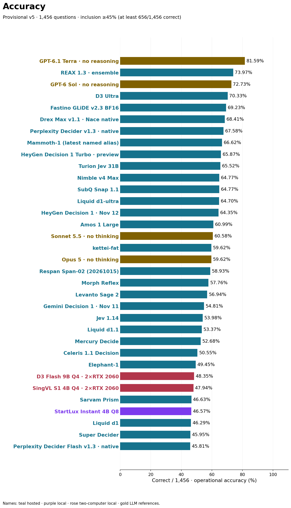

| Configuration | Correct / 1,456 | Accuracy | Median | p95 | Selected-record known cost | Cost / 1,000 | Usable | Cost evidence |
|---|---:|---:|---:|---:|---:|---:|---:|---|
| GPT-6.1 Terra · no reasoning | 1188/1,456 | 81.59% | 🟥 1,160 ms | 🟥 1,729 ms | 🟥 $0.75733 + ? | 🟥 $0.52014 + ? | 1454/1,456 | 1454 reported; 0 estimates; 0 free-access; 2 no-price/usage |
| REAX 1.3 · ensemble | 1077/1,456 | 73.97% | 🟧 946 ms | 🟥 1,541 ms | 🟥 $1.14224 FX est. | 🟥 $0.78451 FX est. | 1456/1,456 | EUR 1.0204992 reported (1456 records); 1456 USD FX estimates; 0 unknown |
| GPT-6 Sol · no reasoning | 1059/1,456 | 72.73% | 🟧 986 ms | 🟥 1,520 ms | 🟥 $1.51532 | 🟥 $1.04074 | 1456/1,456 | 1456 reported; 0 estimates; 0 free-access; 0 no-price/usage |
| D3 Ultra | 1024/1,456 | 70.33% | 🟩 172 ms | 🟨 338 ms | ⬜ Free access + ? | ⬜ Free access + ? | 1456/1,456 | 0 reported; 0 estimates; 1236 free-access; 220 no-price/usage |
| Fastino GLiDE v2.3 BF16 | 1008/1,456 | 69.23% | 🟩 216 ms | 🟧 530 ms | 🟨 $0.02993 | 🟨 $0.02056 | 1456/1,456 | 0 reported; 1456 estimates; 0 free-access; 0 no-price/usage |
| Drex Max v1.1 · Nace native | 996/1,456 | 68.41% | 🟨 345 ms | 🟨 490 ms | 🟨 $0.02355 + ? | 🟨 $0.01618 + ? | 1454/1,456 | 0 reported; 1454 estimates; 0 free-access; 2 no-price/usage |
| Perplexity Decider v1.3 · native | 984/1,456 | 67.58% | 🟩 216 ms | 🟨 335 ms | 🟨 $0.01535 | 🟨 $0.01054 | 1456/1,456 | 0 reported; 1456 estimates; 0 free-access; 0 no-price/usage; actual API charges unreported |
| Mammoth-1 (latest named alias) | 970/1,456 | 66.62% | 🟩 188 ms | 🟧 727 ms | 🟧 $0.04833 + ? | 🟧 $0.03320 + ? | 1455/1,456 | 0 reported; 511 estimates; 724 free-access; 221 no-price/usage |
| HeyGen Decision 1 Turbo · preview | 959/1,456 | 65.87% | 🟨 271 ms | 🟧 899 ms | 🟥 $0.13255 | 🟥 $0.09104 | 1456/1,456 | 1456 reported; 0 estimates; 0 free-access; 0 no-price/usage |
| Turion Jev 31B | 954/1,456 | 65.52% | 🟧 510 ms | 🟥 1,029 ms | 🟩 $0.00110 + ? | 🟩 $0.00076 + ? | 1455/1,456 | 140 reported; 0 estimates; 0 free-access; 1316 no-price/usage |
| Nimble v4 Max | 943/1,456 | 64.77% | 🟩 240 ms | 🟨 351 ms | 🟧 $0.03856 + ? | 🟧 $0.02648 + ? | 1455/1,456 | 0 reported; 1235 estimates; 0 free-access; 221 no-price/usage |
| SubQ Snap 1.1 | 943/1,456 | 64.77% | 🟩 177 ms | 🟩 206 ms | 🟨 $0.03145 | 🟨 $0.02160 | 1456/1,456 | 0 reported; 1456 estimates; 0 free-access; 0 no-price/usage |
| Liquid d1-ultra | 942/1,456 | 64.70% | 🟩 207 ms | 🟨 483 ms | 🟨 $0.02891 + ? | 🟨 $0.01985 + ? | 1454/1,456 | 1454 reported; 0 estimates; 0 free-access; 2 no-price/usage |
| HeyGen Decision 1 · Nov 12 | 937/1,456 | 64.35% | 🟨 340 ms | 🟧 947 ms | 🟥 $0.16276 | 🟥 $0.11178 | 1456/1,456 | 1456 reported; 0 estimates; 0 free-access; 0 no-price/usage |
| Amos 1 Large | 888/1,456 | 60.99% | 🟨 363 ms | 🟧 972 ms | ⬜ Free access + ? | ⬜ Free access + ? | 1456/1,456 | 0 reported; 0 estimates; 1236 free-access; 220 no-price/usage |
| Sonnet 5.5 · no thinking | 882/1,456 | 60.58% | 🟥 1,412 ms | 🟥 2,271 ms | 🟥 $2.90409 | 🟥 $1.99456 | 1456/1,456 | 1456 reported; 0 estimates; 0 free-access; 0 no-price/usage |
| kettei-fat | 868/1,456 | 59.62% | 🟩 188 ms | 🟨 447 ms | 🟧 $0.03953 | 🟧 $0.02715 | 1456/1,456 | 1456 reported; 0 estimates; 0 free-access; 0 no-price/usage |
| Opus 5 · no thinking | 868/1,456 | 59.62% | 🟥 1,566 ms | 🟥 2,211 ms | 🟥 $5.94921 + ? | 🟥 $4.08600 + ? | 1271/1,456 | 1273 reported; 0 estimates; 0 free-access; 183 no-price/usage |
| Respan Span-02 (20261015) | 858/1,456 | 58.93% | 🟨 484 ms | 🟥 2,176 ms | 🟩 $0.00820 | 🟩 $0.00563 | 1456/1,456 | 1456 reported; 0 estimates; 0 free-access; 0 no-price/usage |
| Morph Reflex | 841/1,456 | 57.76% | 🟨 354 ms | 🟧 514 ms | 🟨 $0.03266 | 🟨 $0.02243 | 1456/1,456 | 1456 reported; 0 estimates; 0 free-access; 0 no-price/usage |
| Levanto Sage 2 | 829/1,456 | 56.94% | 🟩 232 ms | 🟨 355 ms | 🟨 $0.03570 | 🟨 $0.02452 | 1456/1,456 | 0 reported; 1456 estimates; 0 free-access; 0 no-price/usage |
| Gemini Decision 1 · Nov 11 | 798/1,456 | 54.81% | 🟨 372 ms | 🟨 496 ms | 🟥 $0.07975 | 🟥 $0.05477 | 1456/1,456 | 1456 reported; 0 estimates; 0 free-access; 0 no-price/usage |
| Jev 1.14 | 786/1,456 | 53.98% | 🟩 173 ms | 🟨 472 ms | 🟧 $0.04736 | 🟧 $0.03253 | 1456/1,456 | 1456 reported; 0 estimates; 0 free-access; 0 no-price/usage |
| Liquid d1.1 | 777/1,456 | 53.37% | 🟩 190 ms | 🟧 529 ms | 🟩 $0.01377 + ? | 🟩 $0.00946 + ? | 1455/1,456 | 1455 reported; 0 estimates; 0 free-access; 1 no-price/usage |
| Mercury Decide | 767/1,456 | 52.68% | 🟨 255 ms | 🟥 1,217 ms | 🟨 $0.01575 + ? | 🟨 $0.01082 + ? | 1455/1,456 | 1455 reported; 0 estimates; 0 free-access; 1 no-price/usage |
| Celeris 1.1 Decision | 736/1,456 | 50.55% | 🟩 142 ms | 🟨 287 ms | 🟨 $0.03064 + ? | 🟨 $0.02105 + ? | 1456/1,456 | 0 reported; 1236 estimates; 0 free-access; 220 no-price/usage |
| Elephant-1 | 720/1,456 | 49.45% | 🟩 124 ms | 🟨 268 ms | 🟨 $0.01697 + ? | 🟨 $0.01165 + ? | 1456/1,456 | 0 reported; 512 estimates; 724 free-access; 220 no-price/usage |
| D3 Flash 9B Q4 · 2×RTX 2060 | 704/1,456 | 48.35% | 🟧 577 ms | 🟥 6,616 ms | ⬜ Unmetered local | ⬜ Unmetered local | 1455/1,456 | Hardware and electricity unmeasured |
| SingVL S1 4B Q4 · 2×RTX 2060 | 698/1,456 | 47.94% | 🟨 344 ms | 🟥 1,164 ms | ⬜ Unmetered local | ⬜ Unmetered local | 1456/1,456 | Hardware and electricity unmeasured |
| Sarvam Prism | 679/1,456 | 46.63% | 🟨 409 ms | 🟨 466 ms | 🟨 $0.03239 | 🟨 $0.02225 | 1456/1,456 | 0 reported; 1456 estimates; 0 free-access; 0 no-price/usage |
| StartLux Instant 4B Q8 | 678/1,456 | 46.57% | 🟨 336 ms | 🟧 901 ms | ⬜ Unmetered local | ⬜ Unmetered local | 1456/1,456 | Hardware and electricity unmeasured |
| Liquid d1 | 674/1,456 | 46.29% | 🟩 175 ms | 🟧 768 ms | 🟩 $0.01378 | 🟩 $0.00946 | 1456/1,456 | 1456 reported; 0 estimates; 0 free-access; 0 no-price/usage |
| Super Decider | 669/1,456 | 45.95% | 🟩 215 ms | 🟨 263 ms | 🟨 $0.02412 | 🟨 $0.01657 | 1456/1,456 | 0 reported; 1456 estimates; 0 free-access; 0 no-price/usage |
| Perplexity Decider Flash v1.3 · native | 667/1,456 | 45.81% | 🟩 125 ms | 🟩 147 ms | 🟩 $0.00767 | 🟩 $0.00527 | 1456/1,456 | 0 reported; 1456 estimates; 0 free-access; 0 no-price/usage; actual API charges unreported |

## Perplexity v1.3 and HeyGen Decision 1

Four full-bank native hosted sessions add 5,824 first attempts, all usable, with no errors, scored retries or client truncation. The frozen 1,456-question/43-category bank and exact 45% cutoff are unchanged. There are 42 complete configurations, 34 active, six below cutoff and two superseded versions. Perplexity Decider v1.3 replaces v1.2 in the active comparison under the standing current-version policy; all older measurements and primary records remain unchanged. The new direct route/version/date and cost basis remain separately labelled.

Perplexity Decider v1.3 scored 984/1,456 (67.58%), versus v1.2’s 949; median response time was 215.68 ms versus 245.84 ms. Flash v1.3 scored 667/1,456 (45.81%) at a 124.87 ms median. HeyGen Decision 1 scored 937/1,456 (64.35%) at 340.16 ms, and Turbo preview 959/1,456 (65.87%) at 270.98 ms. Turbo adds 22 correct answers with lower measured median and API-reported cost. The paired HeyGen outcomes were 863 both correct, 74 standard-only, 96 Turbo-only and 423 neither. Both remain distinct native decision models; Turbo is preview, not an ordinary generative LLM reference.

Current active ranks: Perplexity Decider v1.3 · native 7/34, HeyGen Decision 1 Turbo · preview 9/34, HeyGen Decision 1 · Nov 12 14/34, Perplexity Decider Flash v1.3 · native 34/34.

Perplexity’s native input tariffs of USD 0.02/M (Decider) and 0.01/M (Flash) yield captured estimates of USD 0.01534610 and 0.00767305. All 1,456 primaries per model have estimates, but actual API monetary charges are unreported for all 1,456; they are not reported zero charges. Separate readiness estimates of USD 0.00000194 and 0.00000097 are excluded. HeyGen API-reported charges total USD 0.16275784 standard and 0.13255038 Turbo, with no missing charges; their separate USD 0.00001666 and 0.00001071 readiness charges are excluded. These are session subtotals and captured tariffs, not future price guarantees.

Both Perplexity native /v1/decisions requests named explicit v1.3 versions; returned model fields echo those versions without independently attesting immutable weights. HeyGen used OpenRouter’s native Decisions API pinned to HeyGen, declaring November 12 snapshots. Precision is unknown for all four, and each retained 17 matching metadata checks. Perplexity reports one raw output-accounting token per question (1,456 per model), retained without a zero-counter requirement. HeyGen reports zero output tokens. No generated reasoning text was observed, and hidden weights and generation implementation were not independently attested. Per-request timing pools individual primaries and excludes idle dispatch pacing; it is not sustained throughput. HeyGen dispatch gaps met the one-second floor; transport starts after TLS setup are a different timestamp and can be closer together.


## Gemini Decision 1: native hosted decisions

Gemini Decision 1 scored 798/1,456 (54.81%), with all 1,456 responses usable, ranking 22nd among 34 active configurations. Median/p95 complete-response latency was 372.08/495.57 ms. API-reported charges total USD 0.0797482, with no missing charges; the separate USD 0.0000116 readiness charge is excluded.

Gemini adds 12 correct answers over Jev 1.14 (786/1,456) at 2.15 times its median latency. Morph Reflex scored 841/1,456 at a 354.45 ms median. It adds 120 correct answers over StartLux Instant 4B Q8, 100 over SingVL and 94 over D3 Flash Q4_K_M. The measurements retain their different routes, dates, precision and hardware.

This is OpenRouter’s native Decisions route pinned to Google AI Studio, requested as google/gemini-decision-1 and returned as google/gemini-decision-1-20261111. Precision is unknown. The fixed full-bank collection on November 12 used first attempts only, with no request errors, scored retries or client truncation and 18 matching metadata snapshots. All responses reported zero output tokens with no generated reasoning text observed; hidden weights and zero-generation internals were not independently attested.


## D3 Flash 9B: a local comparison

D3 Flash 9B Q4_K_M scored 704/1,456 (48.35%), ranking 28th among 34 qualifying configurations. Median/p95 response latency was 577/6,616 ms, with 1,455 usable responses. Rose names and bars identify this two-computer local setup alongside SingVL.

It adds six correct answers over SingVL (0.41 percentage points), at 1.68 times its median latency, and 26 over StartLux Instant 4B Q8. Request routing is 19/31 versus SingVL’s 8/31, and temporal intervals 17/25 versus 9/25. SingVL leads conversational intention (24/33 versus 14/33), quantitative reasoning (93/200 versus 84/200) and reference binding (22/35 versus 15/35). The small overall difference masks distinct task profiles.

The user reports the same ASUS TUF Ryzen 7 and Lenovo Legion Intel Core i7 deployment, each with an RTX 2060 and 6 GB VRAM, using llama.cpp CUDA/RPC over Ethernet. The API declares native D3 Flash Q4_K_M and 4,096 context. Exact weight identity, equivalence to the older Artemis checkpoint, conversion fidelity and actual GPU placement are not independently attested. Hardware and electricity costs are unmetered. Full configuration and collection details accompany the downloadable evidence.


## SingVL: two-computer local inference

SingVL S1 4B Q4_K_M scored 698/1,456 (47.94%), with all 1,456 responses usable. Median/p95 complete-response latency was 344/1,164 ms. Rose model names and bars identify this two-computer local setup. The user reports an ASUS TUF with AMD Ryzen 7 and a Lenovo Legion with Intel Core i7, each with an RTX 2060 and 6 GB VRAM. The ASUS coordinates llama.cpp CUDA/RPC inference with the Lenovo worker over the LAN. Each GPU retains its own memory; the nominal total is 12 GB across the two computers. This is a different deployment from the purple local baselines. Hardware and electricity are unmetered, not zero; latency includes LAN and adapter overhead.

The result meets the fixed 45% cutoff and now ranks 29th among the 34 active configurations. It exceeds StartLux Instant 4B Q8 by 20 correct answers (1.37 percentage points). Necessary conditions (26/32) and forward conditionals (17/22) are relative strengths; robust decisions without a prior (3/39) and value of information (10/40) are weaknesses. Quantitative reasoning is 93/200 versus StartLux’s 75/200; scheduling is 27/54 versus 17/54, and conversational intention is 24/33 versus 14/33. StartLux leads request routing (19/31 versus 8/31) and value of information (20/40 versus 10/40). The overall lead masks different task profiles. The category figures are descriptive and do not establish a general advantage from adding a second GPU.

The serving API declares Q4_K_M weights, llama.cpp b12301-956591f45 and 4,096-token backend context and input allowance. The original 1,024-context 20-question screen is excluded. The hardware description is user-reported; actual GPU placement, weight-file identity, conversion correctness and zero-generation internals were not independently attested through the API. This score applies to the quantized compatibility runtime, not the original full-precision Transformers implementation. All responses returned valid typed decisions and reported zero output tokens, with no generated reasoning text observed.


## Drex Max v1.1: a separately tested native version

Native Drex Max v1.1 replaces the older Drex Max in the active graph under the user’s conditional replacement instruction. The older result remains a superseded reference, with every score and recorded response preserved. It is above the 45% cutoff and is not classified as below cutoff.

The new native Nace API declares Drex Max v1.1, released October 28, whereas the earlier DeepInfra/OpenRouter configuration returned an October 16 checkpoint. The new version scored 996/1,456 (68.41%), versus 952/1,456 (65.38%) previously: +44 correct answers (+3.02 percentage points). New median/p95 response times are 345/490 ms, versus 331/1,324 ms. The paired outcomes include 141 new-only correct and 97 old-only correct answers. These are distinct versions, routes and collection sessions; the comparison does not isolate a weight-only effect.

New Drex has no monetary API charge telemetry. Its captured-tariff estimate is USD 0.02355297 at $0.03 per million reported input tokens, with 2 no-usage primary costs unknown. The previous known API-reported subtotal is USD 0.04695126 plus 9 unknown charges. The new estimate is 0.502× that older known subtotal; this comparison does not establish actual billing savings. The retained no-answer HTTP 429 primaries were never replayed or assigned zero cost. Only unattempted inputs resumed after the rate-limit pause. Collection moved from two workers to sequential pacing; waits are outside request timers, so pooled latency is not uniform-throughput evidence. The provider documents 120 requests/minute for free access and 600 for paid access; applicable limits and phases are recorded separately.

Native Drex returns typed choices and probabilities. Raw output-token counters are nonzero in 1454 responses and sum to 238612. Those counters are preserved under the existing native-choice scoring policy. No generated reasoning text was observed; zero generation is not independently attested and is not claimed. Only the captured input-token tariff enters the cost estimate; output is not billed by that tariff.


## REAX: accuracy with an ensemble cost and latency trade-off

The provider describes REAX 1.3 as a large two-model native decision ensemble: it returns probabilities with zero generated answer tokens. In this full-bank test its cost and latency are closer to the LLM references than to the fastest inexpensive decision specialists. It scored 1077/1,456 (73.97%), versus Terra’s 1188/1,456 (81.59%); its median was 946 ms versus Terra’s 1,160 ms (18.4% faster). REAX’s FX-estimated USD cost is 50.8% higher than Terra’s known USD subtotal on the same 1,456 inputs. Terra has 2 unknown charges, so this compares available subtotals rather than complete final bills.

REAX’s FX-estimated selected-record USD cost is 38.2× Fastino’s tariff-estimated cost and 35.0× Morph Reflex’s API-reported cost. These ratios describe the recorded sessions and conversion rate, not guaranteed future prices. Its accuracy qualifies it for the graph; the ensemble’s resource trade-off remains visible.


Teal model names indicate hosted decisions, purple local baselines, rose the two-computer local D3 and SingVL deployments, and gold reasoning-disabled LLM references. Speed and cost use 🟩 green / 🟨 yellow / 🟧 orange / 🟥 red bands: ≤250 / ≤500 / ≤1,000 / >1,000 ms; ≤$0.010 / ≤$0.025 / ≤$0.050 / >$0.050 per 1,000 questions. ⬜ denotes unmetered or unknown cost. “+ ?” marks missing charges. API-reported USD, tariff estimates, EUR-to-USD FX estimates and free access remain distinct.

## Response time and cost

Timings and costs use individual selected primary records. All 38 preceding configurations are unchanged; four native hosted configurations add separately measured sessions. Morph Reflex and REAX 1.3 retain their preceding full-bank sessions. Median and p95 include selected unsuccessful requests; they are never averages of category medians. Monetary amounts are selected-record charges or estimates, not guaranteed future prices.

Morph Reflex’s selected 1,456 primaries have API-reported USD charges of $0.032662362. REAX 1.3 reports EUR 1.0204992 across 1456 selected primaries. Its USD $1.14224475456 comparison is an FX estimate, using EUR 1 = USD 1.1193 from the ECB reference rate dated 2026-11-09. The converted USD amount was not reported by the provider. Exact native EUR nanos, conversion records and the captured rate receipt are downloadable. Readiness calls and other unscored requests remain outside these totals.

### Response time

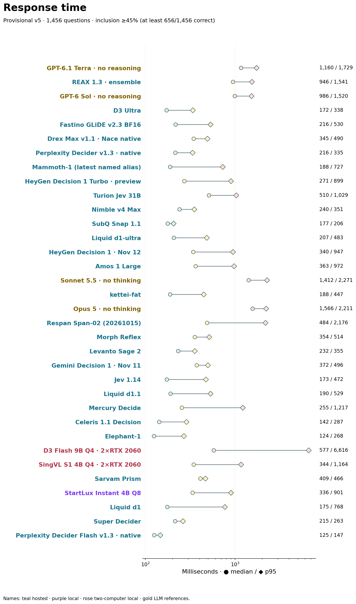

### Cost per 1,000 questions

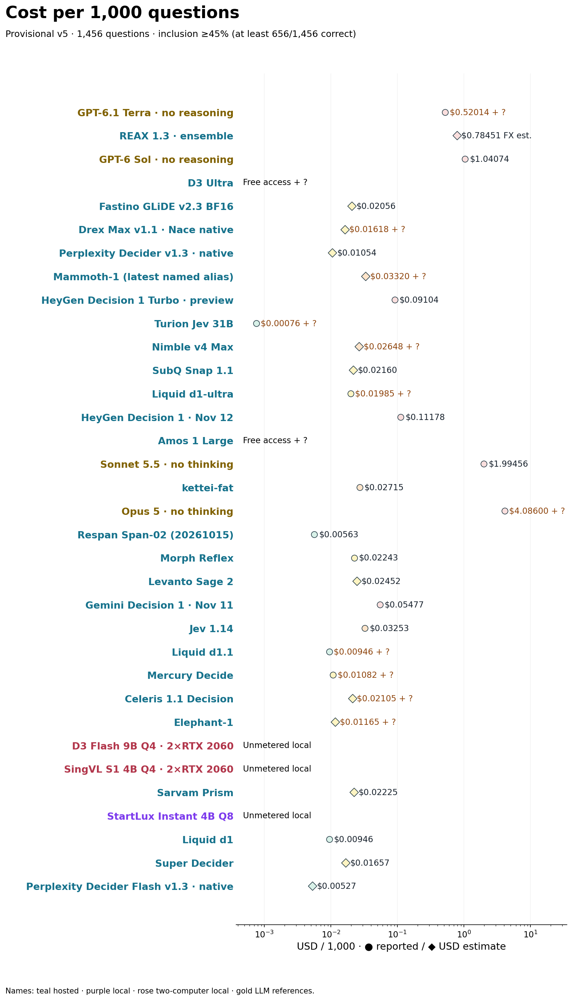

## Category results

The category scale is fixed at 0–100%. Each cell shows correct/retained total and percentage; ★ marks all tied leaders. Category sizes vary after removal.


### Rules, evidence and logical scope

F01 Lookup and filtering (n=5); F02 Forward conditionals (n=22); F03 Necessary conditions (n=32); F04 Boolean scope (n=18); F05 Quantifiers and sets (n=9); F11 Sufficiency and inconsistency (n=29).

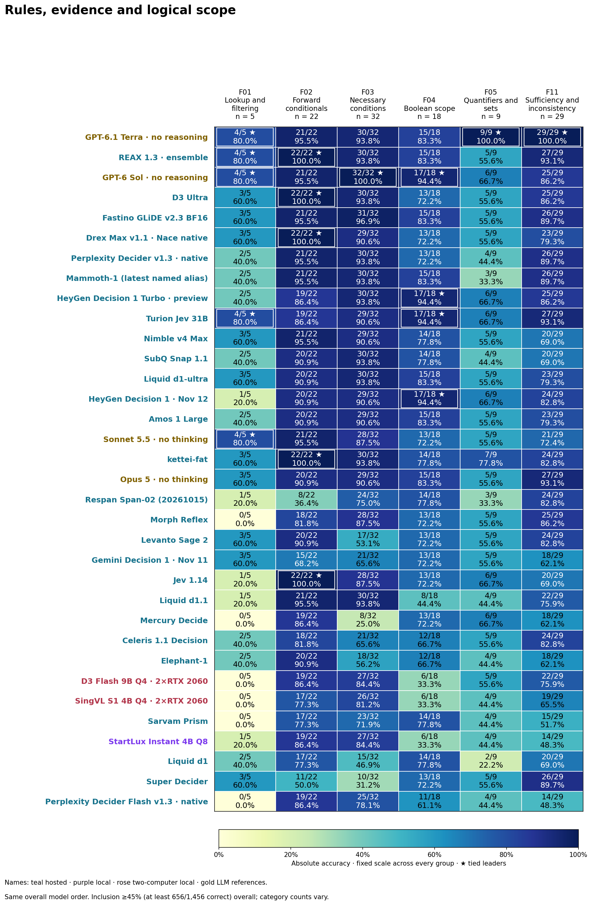

### Ordering, schedules and assignments

F06 Comparisons (n=7); F07 Scheduling (n=54); F08 One-to-one assignments (n=44); F14 Temporal intervals (n=25); F22 Preference ordering (n=9).

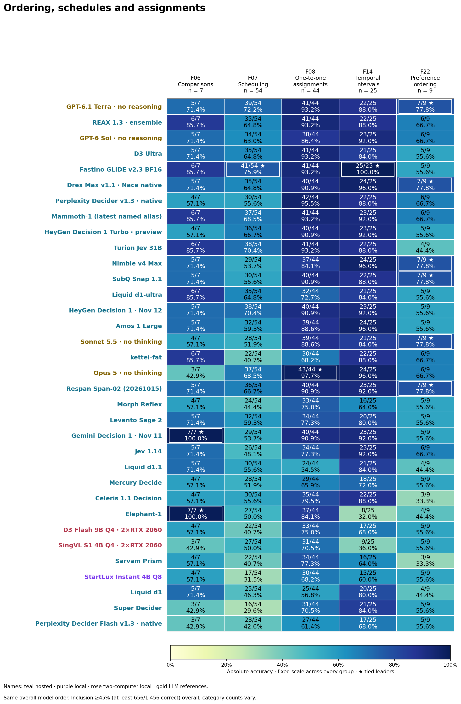

### State tracking and perspectives

F09 Exact truth counting (n=68); F10 Truth-teller consistency (n=69); F12 Object swaps (n=43); F13 Sequential procedures (n=47); F15 Spatial tracking (n=35); F16 Reference binding (n=35); F17 Beliefs and perspectives (n=19).

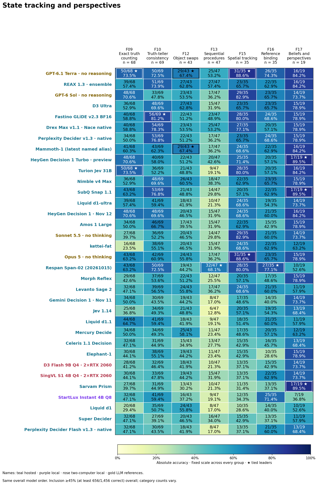

### Causes, plans and authoritative evidence

F18 Causal intervention (n=37); F19 Exceptions and priorities (n=24); F20 Planning (n=16); F21 Directed reachability (n=5); F23 Rule counterexamples (n=14); F24 Authority and stale records (n=8); F25 Fault diagnosis (n=11).

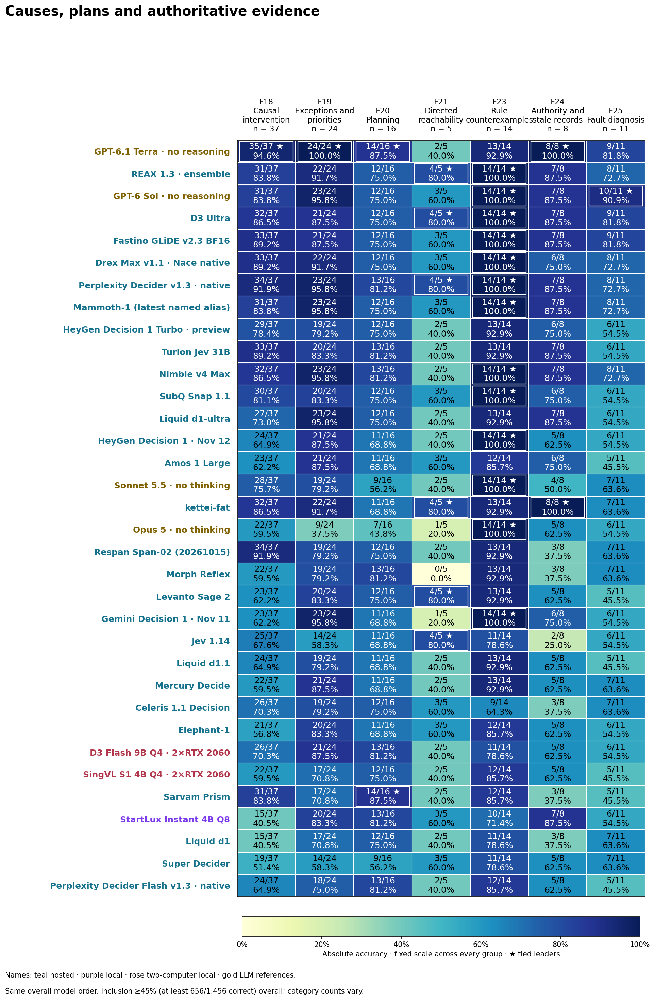

### Decisions under uncertainty

F26 Probabilistic risk (n=30); F27 Value of information (n=40); F28 Robust decisions without a prior (n=39); F29 Strategic decisions (n=39); F30 Concurrent-history consistency (n=38); F31 Information-flow security (n=36).

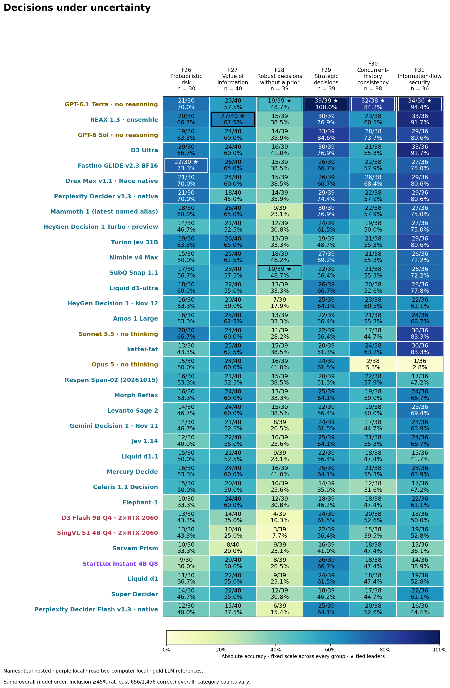

### Practical decisions: scope, policy and actions

P01 Understanding requests and routing (n=31); P02 Recognizing multiple requested actions (n=34); P03 Tracking current conversational intention (n=33); P04 Selecting a tool or requesting clarification (n=35); P05 Checking authorization and scope (n=35).

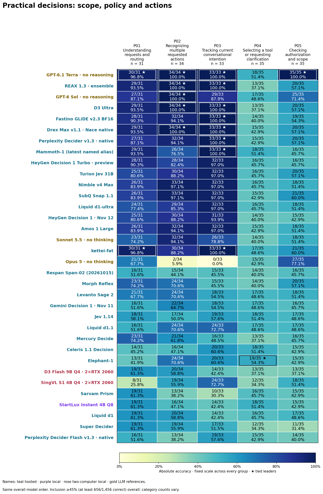

### Practical decisions: evidence, security and quality

P06 Making decisions with untrusted content (n=35); P07 Applying a contextual content policy (n=27); P08 Extracting and normalizing facts (n=36); P09 Checking claims against supplied evidence (n=32); P10 Assigning severity or priority from a rubric (n=31).

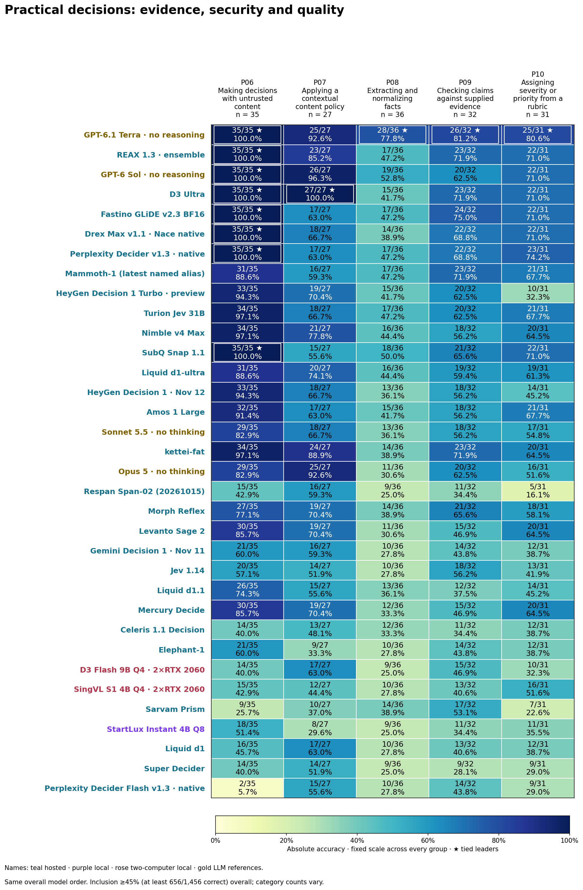

### IQ sequences and admissions-style mathematics

F32 Numerical pattern recognition (n=20); F33 Quantitative reasoning (n=200).

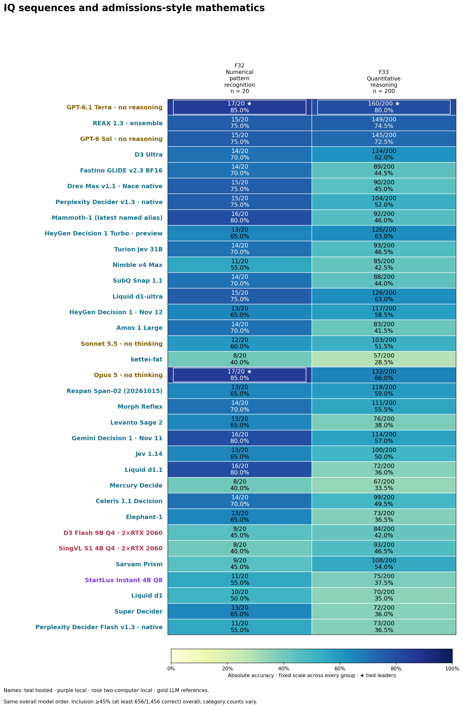

## ASUS native v5 partial screens

These are separate 100-question screens on the fixed answer-blind shuffled v5 prefix, with unstratified category counts. They are not 1,456-question scores, full-bank rankings or classifications against the 45% cutoff. All 42 complete configurations, 34 active rankings, six below-cutoff results, two superseded versions, 61,152-record main ledgers, category tables and graphs remain byte-identical to the preceding hosted release. The same 100 inputs were used for each screen. No score was extrapolated to the unattempted 1,356 questions per model.

| Configuration | Correct / screen | Usable | Median | p95 | Wilson 95% upper | Continuation | Cost |
|---|---:|---:|---:|---:|---:|---|---|
| QEV 0.5B · native FP32 text/readout | 19/100 (19.00%, sample only) | 100/100 | 🟩 169.74 ms | 🟨 454.82 ms | 27.78% | Stopped; no full-bank classification | ⬜ Unmetered hardware / electricity |
| QEV 1.3B · native FP32 text/readout | 22/100 (22.00%, sample only) | 100/100 | 🟨 263.78 ms | 🟧 891.50 ms | 31.07% | Stopped; no full-bank classification | ⬜ Unmetered hardware / electricity |
| GS1 0.8B · native PyTorch FP32 eager resident | 27/100 (27.00%, sample only) | 100/100 | 🟥 1111.32 ms | 🟥 1442.01 ms | 36.43% | Stopped; no full-bank classification | ⬜ Unmetered hardware / electricity |

Each screen stopped at the predefined 100-question check because its Wilson 95% upper bound was below 45%. This is a sequential screening heuristic, not a formal repeated-look guarantee or a full-bank inclusion decision. All attempted answers were usable first primaries; there were no scored retries, errors, truncation or runtime-condition changes. All reported output counters were zero, with no generated reasoning text observed and no independent zero-generation attestation. QEV 0.5B reported abstained=true on five responses and QEV 1.3B on two, while returning valid typed choices; those choices are scored normally and the flags remain in the usage ledger. Local hardware and electricity are unmetered, not zero cost. Pooled individual latencies exclude idle pacing and do not measure sustained throughput.

The user confirmed one ASUS RTX 2060 running the publisher’s native PyTorch implementation with 4,096-token context and one resident model at a time. Server replies declared CUDA, reuse and stable runtime profiles. These declarations do not independently attest GPU execution, exact installed weights or source/conversion fidelity. QEV text/readout was declared FP32 with repeated-KV CUDA SDPA; unused vision weights retained BF16 storage. GS1 used its declared FP32 CUDA eager-reference runtime; its replies did not declare a backbone/version checkpoint, so none is inferred. These samples describe the ASUS-served FP32 configurations; the original BF16 runtime was not measured. The compact QEV 0.5B and 1.3B packages legitimately declare parent QEV 0.8B and 2B backbones; parent names are not a precision or installed-weight attestation. This is a separate native single-GPU configuration from earlier distributed GGUF/llama.cpp/RPC measurements.

Initial model loading, synthetic readiness and oversize checks, earlier 2,048-context per-request preflight, pre-score 4,096-context readiness cycles and the unscored monitor diagnostic are excluded. An unscored control test found that GET /props unloaded native weights; monitoring was changed to catalogue-only before any scored primary. Those earlier records remain separately archived. Source rights, frozen cohort-conditioned question selection, AQuA error-selection dependence and the unresolved original MAIQ item-rights caveat remain unchanged; the 120 companion diagnostics retain separate denominators.

- [Screen method, stops and runtime limitations](results/releases/system1_v5_asus_native_2026-11-13/ASUS_NATIVE_SCREEN_NOTES.md)
- [Separate 100-question screen summaries](results/releases/system1_v5_asus_native_2026-11-13/asus_native_screen_statistics.json)
- [Server-declared runtime profiles and source hashes](results/releases/system1_v5_asus_native_2026-11-13/asus_native_screen_profiles.json)
- [Partial-screen individual timing evidence](results/releases/system1_v5_asus_native_2026-11-13/asus_native_screen_timing.csv.gz)
- [Partial-screen unmetered cost evidence](results/releases/system1_v5_asus_native_2026-11-13/asus_native_screen_cost.csv.gz)
- [Partial-screen correctness and usability booleans](results/releases/system1_v5_asus_native_2026-11-13/asus_native_screen_correctness.csv.gz)
- [Partial-screen native usage and record hashes](results/releases/system1_v5_asus_native_2026-11-13/asus_native_screen_usage.csv.gz)
- [Partial-screen audit and review provenance](results/releases/system1_v5_asus_native_2026-11-13/asus_native_screen_audit.json)
- [Frozen full-bank parent manifest](results/releases/system1_v5_asus_native_2026-11-13/parent_hosted_refresh_manifest.json)

## Below the 45% cutoff

V5 uses the retained 1,456-question bank and 45% cutoff. Historical v4 scores below use its original 2,157 questions and former 62% cutoff.

- **Drex v2.0: v5 653/1,456 (44.85%)**; coverage 95.26%. Historical v4: 1296/2,157 (60.08%).
- **Microsoft-Decision-1: v5 637/1,456 (43.75%)**; coverage 100.00%. Historical v4: 1315/2,157 (60.96%).
- **D3 Artemis 9B IQ3_M: v5 631/1,456 (43.34%)**; coverage 88.74%. Historical v4: 1322/2,157 (61.29%).
- **Cloudflare Clef: v5 615/1,456 (42.24%)**; coverage 100.00%. Historical v4: 1299/2,157 (60.22%).
- **Cerno 4B v1.2 NF4: v5 598/1,456 (41.07%)**; coverage 89.90%. Historical v4: 1276/2,157 (59.16%).
- **meraGPT Decider 1: v5 338/1,456 (23.21%)**; coverage 100.00%. Historical v4: 620/2,157 (28.74%).

## Superseded versions retained for reference

Version replacement is separate from the 45% cutoff. All measurements and recorded responses remain available.

- **Drex Max: 952/1,456 (65.38%)**; median/p95 331/1,324 ms; known cost $0.04695 + ?. Superseded by the separately tested native version, not below cutoff.
- **Perplexity Decider v1.2: 949/1,456 (65.18%)**; median/p95 246/416 ms; known cost $0.01572 + ?. Superseded by the separately tested native version, not below cutoff.

## Historical v4 exploratory screens

These are unchanged historical samples with their original denominators, not v5 scores or classifications against its threshold. No stopped test was resumed.

- **Strike 1:** 57/100 correct; free-tier screen stopped after 100 requests. [Historical method and limits](results/releases/system1_v5_asus_native_2026-11-13/STRIKE_SCREEN_NOTES.md).
- **Hanzo Kai 1.9:** 46/244 correct; the free daily cap was followed by a separate eight-hour plan window after credits were purchased. The user stopped the test. [Historical method and limits](results/releases/system1_v5_asus_native_2026-11-13/KAI_CASE_NOTE.md).
- **THIS/THAT 1.2 and GLiNER2.5-Decide:** THIS/THAT: 32/100 correct. GLiNER: 4/14 usable answers, plus 6 input-length rejections in 20 attempts. [Historical method and limits](results/releases/system1_v5_asus_native_2026-11-13/LOCAL_SCREEN_NOTES.md).
- **Hindsight and Lumma:** Hindsight: 29/100 correct. Lumma: 452/799 attempts correct, including an unavailable request. [Historical method and limits](results/releases/system1_v5_asus_native_2026-11-13/NEW_LOCAL_SCREEN_NOTES.md).
- **GPT-6 Luna Decisions:** 82/181 correct on the separately attempted additions; historical baseline 758/1,342. The expansion stopped below its recorded 50% rule. [Historical method and limits](results/releases/system1_v5_asus_native_2026-11-13/OPENAI_DECISIONS_NOTES.md).

## Selection, scope and limitations

The removed set was chosen using the exact recorded answers of the original 26-model v4 main graph, including four reasoning-disabled LLM references. This cohort-conditioned selection leaves the original cohort’s relative overall order unchanged and changes category weights unevenly. It is not an independent demonstration of general difficulty. Future configurations use the frozen 1,456 inputs and exact 45% threshold.

The quantitative category retains 60 questions selected for Fastino/D3 Artemis errors and 140 selected for an error by at least one of Fastino, Mammoth, GPT-6 Sol, D3 Ultra or Drex Max. Multiple selection models distribute that dependence without removing it. Public questions may appear in training data; these scores are not human IQ norms. The separate 120 companion diagnostics remain excluded.

The smaller bank reduces future requests by **701/2,157 (32.5%)**. Token charges need not fall by the same proportion. Costs and response times preserve differences in dates, routes, model settings, precision and hardware.

## Question origins and licenses

The retained bank has **1,236 questions from the project development bank, 20 MAIQ number sequences and 200 AQuA quantitative questions**. AQuA-RAT declares Apache-2.0 and contains crowdsourced admissions-style mathematics, not authenticated official GRE or SAT questions. MAIQ’s repository declares MIT, but original human-test item rights remain unestablished; inclusion retains that caveat. The development lineage does not fully establish individual authorship or possible external influences for every project-bank item. The project MIT license does not supersede third-party rights. The two noncommercial LogiQA items remain outside the bank. [Full source and license notices](results/releases/system1_v5_asus_native_2026-11-13/SOURCE_AND_LICENSES.md).

## Download and reproducibility

Ranks in archived collection notes and release-time analysis files describe their original dated cohort. Current cohort ranks appear in the main comparison and current model sections above.

- [Answer-free provisional v5 questions](results/releases/system1_v5_asus_native_2026-11-13/questions_1456.jsonl)
- [Question-level origin and license metadata](results/releases/system1_v5_asus_native_2026-11-13/source_metadata_1456.jsonl)
- [Source and license notes](results/releases/system1_v5_asus_native_2026-11-13/SOURCE_AND_LICENSES.md)
- [All model summaries](results/releases/system1_v5_asus_native_2026-11-13/statistics.json)
- [All models by 43 categories](results/releases/system1_v5_asus_native_2026-11-13/all_category_scores.csv)
- [Retained timing and status evidence](results/releases/system1_v5_asus_native_2026-11-13/timing_evidence.csv.gz)
- [Retained cost evidence](results/releases/system1_v5_asus_native_2026-11-13/cost_evidence.csv.gz)
- [Retained cost summaries](results/releases/system1_v5_asus_native_2026-11-13/cost_statistics.json)
- [Category guide](results/releases/system1_v5_asus_native_2026-11-13/category_guide.json)
- [701 removed question IDs and categories](results/releases/system1_v5_asus_native_2026-11-13/removed_items.csv)
- [1,456 retained question IDs and categories](results/releases/system1_v5_asus_native_2026-11-13/retained_items.csv)
- [Fixed selection cohort and subset provenance](results/releases/system1_v5_asus_native_2026-11-13/selection_provenance.json)
- [Retained correctness and usability booleans](results/releases/system1_v5_asus_native_2026-11-13/correctness_evidence.csv.gz)
- [Removed-item correctness and usability booleans](results/releases/system1_v5_asus_native_2026-11-13/removed_correctness_evidence.csv.gz)
- [Historical no-answer recovery evidence](results/releases/system1_v5_asus_native_2026-11-13/transport_recoveries.json)
- [Historical collection recovery evidence](results/releases/system1_v5_asus_native_2026-11-13/model_collection_recoveries.json)
- [Historical context diagnostics](results/releases/system1_v5_asus_native_2026-11-13/model_context_diagnostics.json)
- [Subset audit receipt](results/releases/system1_v5_asus_native_2026-11-13/audit_receipt.json)
- [Release checksums](results/releases/system1_v5_asus_native_2026-11-13/manifest.json)
- [Morph and REAX configuration, collection and billing notes](results/releases/system1_v5_asus_native_2026-11-13/HOSTED_MODEL_NOTES.md)
- [Independent new-model audit summaries](results/releases/system1_v5_asus_native_2026-11-13/hosted_model_audits.json)
- [New-model cost summaries](results/releases/system1_v5_asus_native_2026-11-13/hosted_cost_summaries.json)
- [Full-bank REAX, Terra, Fastino and Morph comparisons](results/releases/system1_v5_asus_native_2026-11-13/new_model_comparison.json)
- [REAX ensemble accuracy, speed and cost trade-off](results/releases/system1_v5_asus_native_2026-11-13/REAX_TERRA_COMPARISON.md)
- [Native EUR charges and separately estimated USD conversion](results/releases/system1_v5_asus_native_2026-11-13/native_currency_cost_evidence.csv.gz)
- [Captured ECB rate receipt](results/releases/system1_v5_asus_native_2026-11-13/fx_receipt.json)
- [Captured ECB exchange-rate XML](results/releases/system1_v5_asus_native_2026-11-13/ecb_eurofxref_2026-11-09.xml)
- [Frozen initial v5 audit receipt](results/releases/system1_v5_asus_native_2026-11-13/baseline_v5_audit_receipt.json)
- [Drex native version, replacement and collection notes](results/releases/system1_v5_asus_native_2026-11-13/DREX_VERSION_NOTES.md)
- [Drex old/new paired comparison and replacement decision](results/releases/system1_v5_asus_native_2026-11-13/drex_comparison.json)
- [Drex first-primary audit](results/releases/system1_v5_asus_native_2026-11-13/drex_model_audit.json)
- [Drex per-primary input usage and retained raw output counters](results/releases/system1_v5_asus_native_2026-11-13/drex_usage_evidence.csv.gz)
- [Drex raw output-counter interpretation](results/releases/system1_v5_asus_native_2026-11-13/drex_counter_policy.json)
- [Drex version and provider provenance](results/releases/system1_v5_asus_native_2026-11-13/drex_version_provenance.json)
- [Drex concurrency and rate-limit collection phases](results/releases/system1_v5_asus_native_2026-11-13/drex_transport_phases.json)
- [Frozen preceding hosted-release audit receipt](results/releases/system1_v5_asus_native_2026-11-13/parent_hosted_audit_receipt.json)
- [SingVL distributed deployment and collection notes](results/releases/system1_v5_asus_native_2026-11-13/SINGVL_DISTRIBUTED_NOTES.md)
- [User-reported hardware and captured serving configuration](results/releases/system1_v5_asus_native_2026-11-13/singvl_hardware.json)
- [Independent SingVL first-primary audit](results/releases/system1_v5_asus_native_2026-11-13/singvl_model_audit.json)
- [Per-primary native usage and source hashes](results/releases/system1_v5_asus_native_2026-11-13/singvl_usage_evidence.csv.gz)
- [Historical SingVL release-time category analysis](results/releases/system1_v5_asus_native_2026-11-13/singvl_analysis.json)
- [Previous Drex-release audit receipt](results/releases/system1_v5_asus_native_2026-11-13/parent_drex_audit_receipt.json)
- [D3 Flash configuration and neutral collection record](results/releases/system1_v5_asus_native_2026-11-13/D3_FLASH_NOTES.md)
- [D3 user-reported deployment and serving configuration](results/releases/system1_v5_asus_native_2026-11-13/d3_flash_hardware.json)
- [Independent D3 first-primary audit](results/releases/system1_v5_asus_native_2026-11-13/d3_flash_model_audit.json)
- [D3 native usage and retained missing telemetry](results/releases/system1_v5_asus_native_2026-11-13/d3_flash_usage_evidence.csv.gz)
- [D3 request pacing and retained timeout evidence](results/releases/system1_v5_asus_native_2026-11-13/d3_flash_transport_phases.json)
- [Historical D3 release-time category and paired analysis](results/releases/system1_v5_asus_native_2026-11-13/d3_flash_analysis.json)
- [D3 against every preceding model by category](results/releases/system1_v5_asus_native_2026-11-13/d3_flash_category_comparison.csv)
- [Frozen preceding SingVL audit receipt](results/releases/system1_v5_asus_native_2026-11-13/parent_singvl_audit_receipt.json)
- [Gemini native configuration and collection notes](results/releases/system1_v5_asus_native_2026-11-13/GEMINI_DECISION1_NOTES.md)
- [Independent Gemini first-primary audit](results/releases/system1_v5_asus_native_2026-11-13/gemini_decision1_model_audit.json)
- [Gemini per-primary usage, declared snapshot and API-reported USD](results/releases/system1_v5_asus_native_2026-11-13/gemini_decision1_usage_evidence.csv.gz)
- [Gemini release-time categories and paired comparisons](results/releases/system1_v5_asus_native_2026-11-13/gemini_decision1_analysis.json)
- [Gemini against all 37 preceding models by category](results/releases/system1_v5_asus_native_2026-11-13/gemini_decision1_category_comparison.csv)
- [Frozen preceding D3 audit receipt](results/releases/system1_v5_asus_native_2026-11-13/parent_d3_flash_audit_receipt.json)
- [Perplexity/HeyGen configuration, version replacement and cost qualifications](results/releases/system1_v5_asus_native_2026-11-13/HOSTED_REFRESH_NOTES.md)
- [Four native hosted first-primary audits](results/releases/system1_v5_asus_native_2026-11-13/hosted_refresh_model_audits.json)
- [Four native hosted usage and cost records](results/releases/system1_v5_asus_native_2026-11-13/hosted_refresh_usage_evidence.csv.gz)
- [Current-release full category and paired analyses](results/releases/system1_v5_asus_native_2026-11-13/hosted_refresh_analysis.json)
- [Four models against every other measured configuration by category](results/releases/system1_v5_asus_native_2026-11-13/hosted_refresh_category_comparison.csv)
- [Perplexity native version replacement decision](results/releases/system1_v5_asus_native_2026-11-13/pplx_version_comparison.json)
- [Frozen preceding Gemini-release audit receipt](results/releases/system1_v5_asus_native_2026-11-13/parent_gemini_audit_receipt.json)

The [scripts/](scripts/README.md) support offline validation without credentials. The [preceding hosted v5 report](https://github.com/etsabary/system-1-decision-benchmark/blob/main/results/releases/system1_v5_hosted_2026-11-09/report.html), [initial v5 report](https://github.com/etsabary/system-1-decision-benchmark/blob/main/results/releases/system1_v5_provisional_2026-11-09/report.html), [full v4 report](https://github.com/etsabary/system-1-decision-benchmark/blob/main/results/releases/system1_v4_openai_2026-11-06/report.html), [v3](https://github.com/etsabary/system-1-decision-benchmark/blob/main/results/releases/system1_v3_presentation_2026-11-01/report.html) and [v2](https://github.com/etsabary/system-1-decision-benchmark/blob/main/results/releases/system1_v2_presentation_2026-11-01/report.html) remain unchanged. Model-selected choices and the gold scoring key remain private.

```sh
python3 scripts/validate_system1_v5_hosted_refresh_2026_11_13.py results/releases/system1_v5_hosted_refresh_2026-11-13 results/releases/system1_v5_gemini_decision1_2026-11-13
python3 scripts/validate_october21_release.py
```

Validate the ASUS screen successor and its unchanged full-bank parent:

```sh
python3 scripts/validate_system1_v5_asus_native_2026_11_13.py results/releases/system1_v5_asus_native_2026-11-13 results/releases/system1_v5_hosted_refresh_2026-11-13 --mirror docs/v5
```
